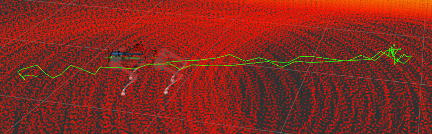
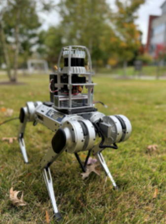
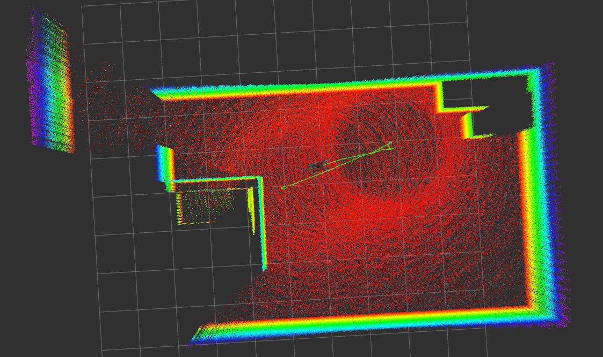

*~30 min read. A walkthrough of [an undergrad project](paper.pdf) where I built a multimodal SLAM system for a quadruped.*

**Contents.** [The puzzle](#one-sensor) · [Three ways to think about SLAM](#three-framings) · [Factor graphs](#factor-graphs) · [The factors](#factors) · [Putting it together](#system) · [Results](#results) · [What I'd change](#reflection) · [Open questions](#open)

---

Try this. Close your eyes, then walk ten paces down a hallway you know well. Stop. Where are you, exactly? You can probably guess to within a step — your inner ear tracked your turns, your legs counted the strides, your skin noticed the moment the rug gave way to tile.

Now do the same on roller skates. With a head cold. With your ankles taped so you can't feel the floor.

Each missing sense ratchets up the difficulty. None of them, on its own, is sufficient. The senses mostly agree, except when they don't, and the only way to keep walking — let alone keep a map of where you've been — is to fuse them and to know, in real time, which of them is currently lying. 

That's the problem this post is about. It is called **simultaneous localization and mapping**, or SLAM, and the version I built was for a four-legged robot. Its senses were a lidar, a camera, an inertial measurement unit (IMU), and the angles of the robot's own joints. My job — and the job of the system — was to keep all four of them honest.

Prerequisites and how to read this
You'll get more out of this with comfort in linear algebra, probability, and a working idea of rigid-body transformations ($SE(3)$). I sketch the bits I need. If the manifold-Jacobian half of the optimization is unfamiliar, my [earlier post on Lie groups](/posts/lie-groups-for-robotics/) covers it. Sections that get notation-heavy are flagged; you can skim them on a first pass and the post still hangs together.

## Three ways to think about SLAM 

Before any math, three honest framings. You'll want all three before this post ends, and I find that having all three at hand is what stops SLAM from feeling like a wall of acronyms.

Framing 1 — Chicken and egg
To know where you are, you need a map. To make a map, you need to know where you are. SLAM is what you do when you stop trying to solve either piece in isolation and tackle the joint problem head-on. The miracle — and it's genuinely a small miracle — is that the joint problem is *more* tractable than either of its halves. The constraints between the unknowns help.

Framing 2 — Detective work
You have a stack of unreliable witnesses. The lidar swears it saw a wall two meters ahead. The IMU insists you turned 0.3 radians while it said that. The front-left foot is convinced it has been rooted to the same patch of floor for the last second and a half. Each witness has a known *reliability* — a covariance, in the dialect of the field. Your job is to write down the single story that best explains all of them, weighted by how much you trust each one.

Framing 3 — A computational shape
The detective story above, with enough Bayes and a couple of standard Gaussian assumptions, condenses into a sum of squared error terms over a graph of variables — a sparse nonlinear least-squares problem you can hand to a solver. This is the framing under which the system actually runs. It's also the framing in which it runs *fast*.

We'll start at the first, walk through the second, and end at the third. By the end you'll know what each of those squared error terms means, what each looks like when it goes wrong, and how the system catches them at it.

## Why one sensor is never enough

Every sensor a quadruped carries has a regime in which it is excellent and a regime in which it is hopeless. Before designing the system, I wrote the failure modes down. The design of any multimodal estimator is, in essence, a list of "which sensor saves us when this other one goes blind."

**Lidar** measures geometry directly. It is wonderful when geometry is informative. It fails in three classic ways, and each one has a name in the field. *Self-similar environments* — a long, featureless corridor; a parking garage; the inside of a pipe — give the registration nothing to lock onto along the corridor's axis. The robot slides forward and the lidar reports it hasn't moved. *Open spaces* — a warehouse, a field — return mostly ground points and distant noise, again without a reliable feature for alignment. *Choke points* — narrow doorways — momentarily reduce the visible scene to a slim cone of geometry, and the registration becomes ill-conditioned for the duration of the door. None of these are noise problems. They are *information* problems. Adding a denser lidar does not help.

**Cameras** see texture and semantics. They handle long corridors fine; there is almost always a poster, a door frame, an overhead light to lock onto. But cameras are 2D projections of a 3D world, so depth is recovered only through parallax — through stereo, or through motion — and that depth is noisy in proportion to range squared. Cameras fail dramatically in low light, in front of textureless walls, and on glass.

**IMUs** measure the robot's own acceleration and angular velocity. They are completely insensitive to the world; there is no degenerate environment for an IMU. Their failure mode is internal. The measurements are biased and noisy, and we recover position by integrating them twice, so error in acceleration grows like $t^2$ in position. Worse: orientation error rotates the integrated acceleration vector, which feeds *back* into position, which feeds *back* into the next iteration. Drift compounds. Fast.

<iframe src="imu-drift.html" height="540"></iframe>

*Even a small bias spirals an IMU-only estimate off the truth in seconds. The integrator is right in expectation; that is not the same as being right in practice.*

**Joint kinematics** — the angles of the leg joints — give us a measurement of where each foot is relative to the body. When a foot is planted, that relation pins down a relationship between the body and a fixed point in the world. This is enormously useful, and we will spend a whole section on it later. The catch is that joint angles only constrain the body when feet are actually planted, and even then, a single foot leaves a rotational degree of freedom around itself. They are also subject to slip on loose terrain, and to *spurious contact noise* — brief electrical glitches in the contact-detection pipeline that, taken at face value, would tell the optimizer that a foot teleported.

The argument for fusion writes itself. Lidar nails position when geometry is informative. The camera fills in the semantics that lidar can't see. The IMU provides high-rate motion regardless of environment. The legs provide a slow, accurate relative-motion estimate when in contact. Each sensor's failure mode is exactly the regime in which one of the others is fine. We just need a framework that lets us combine them — and lets us downweight any of them when the present situation is bad for it.

That framework is what I'll build up next. The TL;DR of where we're going: multiply some Gaussians, take a log, and turn the whole thing into a least-squares problem on a graph.

## The shape of the answer

The framework is **maximum a posteriori (MAP)** estimation. We have a set of unknown variables $\mathcal{X}$ — the robot's poses and velocities over time, the positions of contact points, the positions of semantic landmarks — and a set of measurements $\mathcal{Z}$ collected from our sensors. We want the values of $\mathcal{X}$ that are most likely given $\mathcal{Z}$:

$$
\mathcal{X}^* \;=\; \underset{\mathcal{X}}{\arg\max}\;p(\mathcal{X}\mid \mathcal{Z}).
$$

Bayes's rule rearranges this into a likelihood and a prior. Two Gaussian assumptions — that each measurement is noisy in the zero-mean Gaussian sense, and that measurements are conditionally independent given $\mathcal{X}$ — collapse the negative log of the posterior into a sum of squared **Mahalanobis distances**:

$$
\mathcal{X}^* \;=\; \underset{\mathcal{X}}{\arg\min}\;\sum_k \bigl\|\, r_k(\mathcal{X})\,\bigr\|^2_{\Sigma_k}, \qquad \|e\|^2_\Sigma \triangleq e^T \Sigma^{-1} e.
$$

Each $r_k(\mathcal{X})$ is the **residual** of one measurement: a vector that is zero when the variables and the measurement are perfectly consistent, and grows as they diverge. Each $\Sigma_k$ is the noise covariance of that measurement, and the inverse-covariance weighting encodes exactly the obvious thing — measurements you trust more (smaller $\Sigma$) get a louder vote. This is the witnesses-and-reliabilities metaphor from Framing Two, written down.

This is the *workhorse* formulation. It is what bundle adjustment optimizes. It is what visual-inertial odometry optimizes. It is what every modern SLAM system optimizes, because every modern SLAM system is, when you scrape off the branding, a list of residuals and a least-squares solver. So: given that the *shape* of the answer is fixed, the interesting question is what residuals we put into the sum.

## Factor graphs 

The natural data structure for "a sum of squared residuals over a shared set of variables" is the **factor graph**. Variables are nodes; residuals are *factor* nodes connected to the variables they constrain. Visually, the factor graph is a picture of which measurements touch which unknowns. Computationally, it is the data structure on which a solver like [GTSAM](https://github.com/borglab/gtsam) operates.

<iframe src="factor-graph.html" height="560"></iframe>

*Drag the slider to add factors one at a time. Three things to watch for: most factors are local, a few are not, and each color corresponds to a different physical sensor. The local-vs-global tension is what makes SLAM both feasible (sparse linear algebra) and accurate (long-range constraints stop drift).*

A few observations are worth lingering on, because they will come back when we discuss the sensors individually.

First, **most factors are local**. IMU factors connect consecutive states; forward-kinematics factors connect a state to a single contact point. Local factors mean a sparse Jacobian, and a sparse Jacobian means the linear solve at the heart of each Gauss–Newton iteration is cheap — the *information matrix* $H^T \Sigma^{-1} H$ inherits the sparsity, and modern solvers exploit it ruthlessly. Without sparsity, the problem would be unsolvable at any interesting scale. With it, we solve it in real time.

Second, **a few factors are non-local**. Loop closure connects a current state to a state from minutes ago. Lidar factors connect a current state to a "keyframe" state introduced earlier. These long-range links are what stop drift from accumulating. Without them, every estimator slowly walks away from the truth. With them, the trajectory is pinned to itself across history.

Third, **different colors mean different physics**. The structure of each residual, and the appropriate $\Sigma$, depends entirely on the modality. The next several sections walk through each color, in turn.

There is one operational consequence worth naming. A factor is a local thing; adding a sensor to the system means adding a new color of factor. Removing a sensor — because it has failed, or because the next robot doesn't have one — means dropping its factors. Nothing else changes. This modularity ended up being the most useful design property of the entire system, more useful than any one residual.

The optimizer I used was [iSAM2](http://people.csail.mit.edu/kaess/pub/Kaess12ijrr.pdf), an incremental factor-graph solver in GTSAM. iSAM2 keeps a Bayes-tree representation of the graph and re-linearizes only the variables affected by each new factor. Re-linearization, not re-solving from scratch, is how the whole thing runs in real time as new factors stream in.

Now: the factors themselves.

## The factors 

I'll walk through them in roughly the order that motivates them, from the highest-rate sensor (the IMU) to the lowest (semantic landmarks). For each, the same three-part shape — what the residual measures, what its failure mode is, and how the system handles the failure — and at least one concrete debugging story.

### IMU preintegration

The IMU is the system's heartbeat. It runs at over 200 Hz, gives us acceleration and angular velocity in the body frame, and is the only sensor that *never* runs out of measurements.

<iframe src="imu.html" height="540"></iframe>

*The two raw signals an IMU produces — body-frame linear acceleration and yaw rate — for a robot tracing a figure-eight. Pure double-integration of these would reconstruct the trajectory exactly. The catch is that real measurements have a small constant bias and Gaussian noise, both of which compound under double-integration; the [drift visualization](#one-sensor) at the top of the post is what happens when you hand them to an integrator and walk away.*

The naive plan for using these signals is to create a new pose variable for every IMU sample. The naive plan is computationally insane: 200 nodes per second of trajectory. We need a way to summarize a *batch* of IMU samples into a single factor between two pose nodes.

That summarization is called **IMU preintegration**, and the trick has a snag. The result of integrating an IMU depends on its bias estimate, and the bias is one of the variables we're trying to recover. Integrate now, with a stale bias, and the answer will be wrong. Re-integrate every iteration, and we lose the speedup.

The Forster et al. solution is elegant: integrate in a *bias-free local frame*, and store the Jacobians of the precomputed quantity with respect to the bias. When the bias estimate changes during optimization, apply a first-order correction rather than re-integrating from scratch. The precomputed quantity, plus its bias Jacobians, becomes a factor between two augmented states $(X_i, b_i)$ and $(X_j, b_j)$, constraining their relative position, velocity, and orientation in one residual $r_{\mathcal{I}_{ij}}$ with a single covariance.

I'll spare you the algebra here; the Forster paper has the manifold-flavored derivation, and there is no way I can do it justice in three paragraphs. Operationally: *one* IMU factor replaces hundreds of raw samples without throwing away information about bias.

I made one design decision that I would change in hindsight: I held a *single* pair of biases $b^a, b^g$ for the *entire* trajectory, rather than letting them drift over time. In theory this is fragile to initial bias estimation. In practice, on a warm-running IMU, the biases are stable enough that this is mostly fine — the optimization converges them quickly and they stay put. *Mostly* is doing a lot of work in that sentence.

The story behind that figure is that I spent roughly a week trying to figure out why the system seemed to work, but my walls were never quite where they should be. The fix is not elegant: run the system briefly, read off the converged biases, restart with those. A better fix — letting biases evolve as random-walk variables between states — is the first item on the "what I'd change" list at the end.

### Lidar registration

A lidar fires a fan of laser rays and reports the distance to the first thing each ray hits. The collection of returned points is a *scan* — a sparse, noisy snapshot of nearby geometry, taken several times a second.

<iframe src="lidar.html" height="540"></iframe>

*A cluttered room gives the lidar plenty to lock onto. A long corridor gives it almost nothing along the corridor's axis: moving forward and standing still produce identical scans. An open field returns almost nothing at all. The latter two failure modes are not noise — a denser lidar would not help — they are absences of information.*

What we want from each scan is a residual that says: *given a candidate pose for this scan, how well does this scan align with the geometry we already know?*

The standard answer is a flavor of **iterative closest point (ICP)**. The simplest version, point-to-point ICP, minimizes the sum of squared distances between corresponding points in the two clouds. This is fine on rigid surfaces but wrong on smooth ones — a point on a wall doesn't correspond to *one* point on the other cloud, it corresponds to the *plane*. Point-to-plane ICP fixes this by penalizing the distance from a point to its corresponding plane along the plane's normal.

The system I built uses [GICP](https://www.research.ed.ac.uk/files/14056111/GICP_Aleksandr_V_Segal.pdf) (generalized ICP), specifically the [voxelized variant by Koide et al.](https://staff.aist.go.jp/k.koide/projects/icra2021/). GICP is the probabilistic blend of the two: each point gets a small local covariance estimated from its neighborhood — large along the surface, small along the surface normal — and correspondences are weighted by the combined covariances of their endpoints. The result is a registration that behaves like point-to-plane on planar regions, like point-to-point in clutter, and degrades gracefully in between.

This is also our first encounter with **loose coupling**, a design pattern the rest of the system will lean on. GICP runs as a self-contained front-end — separate process, separate code path, separate algorithmic story — and what it produces for the optimizer is a single relative-pose estimate plus a covariance. The factor graph never sees the raw points. The factor graph only sees a 6-vector residual, weighted by a $6 \times 6$ matrix. The benefit is that I can swap GICP for some other registration tomorrow without touching the optimizer; the cost is that information about the *shape* of the disagreement (e.g., which axis is poorly constrained) is summarized into the covariance and could in principle be richer.

A practical aside on the lidar pipeline: a spinning lidar takes 50–100 ms to complete a single scan, and a trotting quadruped moves meaningfully during that window. The points at the *end* of the scan are taken from a slightly different body pose than the points at the *beginning*, so the raw cloud is *skewed* by the robot's own motion. The fix, called **deskewing**, is to ask the IMU's 200 Hz pose estimate where the body was at each ray's exact timestamp, and to back the per-ray motion out before running GICP. This is the system's first piece of cross-pipeline coupling, and you'll see it again in the system diagram later: the IMU is not just one factor's source, it is the high-frequency clock everyone else borrows when they need to know "where was I just now."

In factor-graph terms, GICP gives us a relative-pose estimate $\widetilde{T}_{ki}$ between the current lidar frame and a reference (typically a *keyframe*; more on this in a moment). The residual is

$$
r_{\mathcal{L}_i} \;=\; \mathrm{Log}\!\left(\widetilde{T}_{ki}^{-1}\,T_k^{-1}\,T_i\right),
$$

where $\mathrm{Log} : SE(3) \to \mathfrak{se}(3)$ takes the relative pose to a 6-vector tangent-space coordinate. (If that operator is unfamiliar, [my Lie groups post](/posts/lie-groups-for-robotics/) walks through it from scratch.) The covariance is taken to be isotropic — a simplification, but a defensible one in practice.

Now the failure mode. When lidar registration is in a degenerate regime — corridor, open space, doorway — GICP still returns *some* relative-pose estimate. It just isn't right. It's wildly wrong along whichever axis is unconstrained, and a single wildly wrong factor in a least-squares problem can drag the whole solution somewhere weird.

The fix is a **robust cost function** wrapped around the residual. To see why we need one, look at how a least-squares solver actually weighs measurements:

<iframe src="robust-cost.html" height="500"></iframe>

The plot on the right is the *influence* — the slope of the cost — and it is what tells the solver how hard to pull on the variables in response to a residual. Pure least squares (the $L_2$ line) says influence grows linearly with the residual: a residual ten times bigger pulls ten times harder. That is fatal when you know one of your residuals is corrupted, because the corrupted one will pull harder than every honest one combined.

A robust cost replaces $\|r\|^2$ with a function whose influence saturates (Huber: linear pull beyond $\delta$) or shrinks back toward zero (Cauchy: vanishing pull at large residuals). Concretely, the system uses Huber. Conceptually, the robust cost says: "if the residual is so large it must be a bad measurement, listen to the other measurements instead." This is what lets the system survive lidar's failure modes — when lidar disagrees with everyone else, the robust cost essentially turns it off until it agrees again.

#### A small but high-leverage detail: lidar keyframes

Registering every new scan to its immediate predecessor is, counterintuitively, *more* noisy than registering it to a fixed reference. The reason is mechanical: a quadruped trunk oscillates sinusoidally as the robot trots. Consecutive scans are taken at slightly different heights and pitches; a chain of every-frame relative poses inherits the sinusoidal jitter.

The fix is **keyframing**. Pick a hyperparameter $\epsilon$ — the system uses $\epsilon = 0.1$ m — and only introduce a new lidar reference once the robot has translated $\epsilon$ from the last one. All scans between two keyframes register to the older reference, and they jointly contribute to a denser, more reliable registration. The result is cleaner and cheaper: denser keyframes, fewer of them, drastically less point-cloud memory.

The first time I tuned $\epsilon$ I watched the trajectory go from "definitely shaking" at $\epsilon = 0.05$ m to "definitely smooth" at $\epsilon = 0.20$ m. The right value depends on what you're trying to do downstream. For a navigation stack, smoother is better. For studying the gait, smoother *destroys the signal you're trying to study*. The same hyperparameter is good or bad depending on who's asking.

### Forward kinematics and rigid contact

Now the leg-specific machinery — the part of the project I was most worried about getting right, and the part where building a visualization helped me more than reading the literature.

Two factors come from the legs. The first is the **forward-kinematics factor**. The story it tells is: given the joint angles $\tilde\alpha_i$ of a leg at time $i$, and given a (claimed) world-frame contact point $c_i$ for that foot, here is a constraint on the body pose:

$$
r_{\mathcal{F}_i} \;=\; \mathbf{R}_i\, f(\tilde\alpha_i) \;+\; \vec{p}_i \;-\; \vec{c}_i.
$$

Here $f$ is the leg's forward-kinematic function — joint angles to foot position in the body frame — and $(\mathbf{R}_i, \vec{p}_i)$ is the body pose. The residual is zero exactly when the body pose, the joint angles, and the contact point are mutually consistent. It is easier to see than to read.

<iframe src="contact-factor.html" height="540"></iframe>

*A planar leg in a known body. Plant the foot at a chosen $c$, then drag the body or change a joint angle. Every nonzero residual is a physical impossibility — either the body has teleported, or the joints are mismeasured, or the foot was never planted where you said.*

The visualization is the rosetta stone for me on this factor. The two arms of the residual — the FK foot prediction and the planted contact point — must agree. If they don't, *some* part of the system is wrong, and the optimizer's job is to find the small adjustment to body pose, joint angle, and contact point that drives the disagreement to zero. With four legs, each potentially in contact, you get up to twelve scalar equations per time step constraining six body degrees of freedom — wildly over-determined, and exactly the kind of thing least squares loves.

A simplification I made that earlier work doesn't: I drop the foot's *orientation* and treat each contact as a point in $\mathbb{R}^3$ rather than a frame in $SE(3)$. Quadruped feet are roughly spherical; ground contact does not strongly constrain orientation. Modeling each contact as a point recovers most of the information for half the degrees of freedom.

The second leg factor enforces that a planted foot does not move. This is the **rigid-contact factor**. It connects two contact-point variables $c_i, c_j$ across an interval during which the foot has stayed planted:

$$
r_{\mathcal{C}_{ij}} \;=\; \vec{c}_j \;-\; \vec{c}_i \;-\; \Delta\tilde{c}_{ij}.
$$

The measured $\Delta\tilde{c}_{ij}$ is the *expected* change in contact position over the interval — typically zero for a stationary foot, with a covariance that grows as elapsed time grows and tightens when the contact-detection module is more confident.

A practical wrinkle here. The contact-detection pipeline, which I did not write, occasionally reports brief on-off-on transitions during a stable stance. Spurious. Each one looks to the optimizer like the foot lifted and replanted, which means a new contact variable with no rigid-contact factor anchoring it. Three or four spurious transitions per second per leg is enough to seriously degrade the optimization.

I debugged this for an embarrassingly long time before I noticed the symptom in the contact-state log. The fix is a one-liner: after a contact transition on a leg, ignore further transitions on that leg for a small window $\gamma$ (around 50 ms). I called it "contact debouncing"; it is identical in spirit to the debounce on a mechanical light switch, and it is a useful reminder that a lot of robotics is just signal processing wearing a costume.

### Loop closure

Drift in any odometry system is bounded only by *something else* providing an absolute reference. **Loop closure** is the trick where, when the robot returns to a place it has been before, we add a factor connecting the current pose to the past pose. The benefit is dramatic: a single good loop-closure factor can shrink minutes of accumulated drift in a single optimization step.

Loop closure is also the cleanest example of loose coupling in the system. Like the lidar factor, it does its real work — feature extraction, nearest-neighbor search, geometric verification — in a self-contained front-end that lives entirely outside the optimizer. What enters the factor graph is, again, just a relative-pose estimate and a covariance. Whether the front-end uses a ResNet or a Vision Transformer or a hand-engineered descriptor is the optimizer's blissful ignorance.

The hard part of loop closure is recognizing that the place is the same. Lidar can *verify* whether two scans show the same room, but it cannot efficiently *search* a long pose history for matches — a brute-force lidar comparison against every past keyframe is prohibitive. Vision can do the search cheaply, but is fooled by repeated structure (two corridors with identical walls and lighting will sit on top of each other in feature space). The right answer is to make them collaborate.

Concretely: every $n$th camera frame goes through a [ResNet](https://arxiv.org/abs/1512.03385) backbone, and the resulting 2048-dimensional feature vector is stored alongside the corresponding state. To find loop-closure candidates for the current frame, we look up the $k$ nearest neighbors in feature space — a fast cosine-similarity search. A nearest neighbor is a *candidate*, not a confirmation. To confirm, we run GICP between the lidar scans at the current state and the candidate state. If GICP converges to a small residual, we accept the loop and add a relative-pose factor with the same form as a regular lidar factor.

<iframe src="loop-closure.html" height="540"></iframe>

The neat thing about this design, and the reason I find it satisfying, is the division of labor. The neural network does the easy part — *plausibly the same place* — at scale. The lidar does the hard part — *geometrically the same place* — only on the few candidates that pass the first filter. Neither is trustworthy alone. Together they're closer to it.

The corresponding residual is

$$
r_{\mathcal{O}_i} \;=\; \mathrm{Log}\!\left(\widetilde{T}_{ki}^{-1}\,T_k^{-1}\,T_i\right),
$$

with covariance $\Sigma_{\mathcal{O}}$ that encodes the joint confidence — small feature-space distance plus small GICP residual gives a tight covariance, which pulls hard on the trajectory; either signal weakening loosens the covariance and the loop becomes more of a polite suggestion than a directive.

### Semantic landmarks

The remaining factor uses the camera and depth sensor together to produce a sparse map of *object* landmarks rather than a dense map of points. The pipeline is the standard one. RGB images go through a [Mask R-CNN](https://arxiv.org/abs/1703.06870)-style instance segmentation network, producing per-pixel instance and category labels. Each instance's pixels are back-projected into 3D using the calibrated camera intrinsics and the aligned depth image:

$$
\vec{s}^{jk}_i \;=\; D_i(\vec{u}^{jk}_i)\,\mathbf{K}^{-1}\,\vec{u}^{jk}_i,
$$

where $\vec{u}^{jk}_i = (u, v, 1)^T$ is pixel $j$ of instance $k$ and $D_i$ is the depth at that pixel.

To track the same object across frames I used a combination of latent-space proximity (the segmentation network's per-instance feature vector) and a loose geometric constraint (centroids of two candidate matches should be reasonably close in the world frame). When a match succeeds, we estimate a landmark $\vec{s}_\ell \in \mathbb{R}^3$ and add a residual that ties the current state to it:

$$
r_{X_i,\,\vec{s}_\ell} \;=\; \mathbf{R}_i\,\vec{s}_\ell \;+\; \vec{p}_i \;-\; \vec{s}_i.
$$

Structurally this is identical to the forward-kinematics residual, with a measured landmark in the body frame in place of a measured foot. The covariance is generous and a robust cost is applied — semantic matches are noisier and more often wrong than IMU or lidar measurements, and we never want one bad data association to hijack the optimization.

The honest assessment of this part of the system: it works, it makes the resulting map richer than a pure point-cloud map for downstream tasks, and the data association is the weakest link. A cluster of identical chairs is a reliable way to confuse the matcher. I'll come back to this in the open questions.

## Putting it together 

The factors above are the physics. Getting them to run in real time, in concert, on real-or-simulated hardware is engineering — and engineering the SLAM stack taught me as much as the math did. The system is a [ROS](https://www.ros.org/) package, with one node per sensor pipeline plus an optimization node, communicating over standard topics. The decision to keep each sensor in its own process was deliberate and load-bearing: a crash in the segmentation pipeline should not bring down the IMU integrator, and replacing a sensor's processing with a different implementation should require only changing what publishes on a topic, not editing a monolith.

<iframe src="system-diagram.html" height="540"></iframe>

*Each sensor has its own process. A front-end stage condenses raw measurements into a single factor with a covariance, and the factor graph back-end consumes them as they arrive. The dashed front-end is loop closure, which is itself a small pipeline (ResNet → nearest-neighbor search → GICP verification). The IMU is the only sensor that also publishes a high-rate transform directly, bypassing the optimizer — the orange dashed channel along the bottom — so downstream consumers can always read a fresh pose at 200 Hz.*

A few notes that would be tedious in the paper but matter for anyone trying to reproduce the work.

**Time synchronization.** Sensors arrive at different rates, with packet delays, sometimes out of order. To group measurements into a coherent set of factors at each new state, the optimizer maintains a small circular buffer of recent state timestamps and snaps each new measurement to the closest within a tolerance $\delta$ (we used 1 ms). This avoids creating a state node per sensor packet, which would balloon the graph for no benefit. A handful of measurements get associated to a slightly earlier state than they "should"; the resulting bias is below the noise floor.

**The two-transform pattern.** The IMU node propagates a high-frequency $\mathtt{odom} \to \mathtt{base}$ transform between optimization passes. The optimizer publishes a $\mathtt{map} \to \mathtt{odom}$ transform that "snaps" the high-rate odometry to the corrected map estimate when each pass completes. Downstream consumers (like a navigation stack) always read a fresh pose at full IMU rate, even while optimization is in progress. This is the standard ROS pattern for fusing low- and high-rate state, and it is one of those small ideas that makes a system go from clearly-wrong to obviously-right.

**Calibration.** The Slambox — a custom CAD-modeled rig holding the IMU, lidar, camera, and onboard computer — gave us the rigid intrinsic and extrinsic transforms between sensors for free. Time synchronization between sensors was not handled in hardware; the buffer-based association above absorbed sub-frame timing slop.

## Results 

I evaluated on six trajectories collected in a Gazebo simulation, varying initial pose, velocity profile, room layout, and the ratio of rotation to translation. Sensors were simulated to match a real configuration: an Ouster OS0-32 lidar, an Intel RealSense D435i depth camera, a Vectornav VN-100 IMU, and Unitree joint-state messages. Ground truth came from the simulator. (The simulation-only evaluation is the most significant caveat on the results — see the open questions section for the consequence.)

| # | Duration (s) | Total distance (m) | Avg. velocity (m/s) |
|---|---|---|---|
| 1 | 22 | 30 | 1.36 |
| 2 | 67 | 36 | 0.53 |
| 3 | 93 | 158 | 1.69 |
| 4 | 15 | 8 | 0.53 |
| 5 | 49 | 38 | 0.77 |
| 6 | 18 | 12 | 0.67 |

Absolute pose error (APE) against the simulator ground truth, broken into translational and rotational components:

| # | APE | APE translation (m) | APE rotation (deg) |
|---|---|---|---|
| 1 | 0.044 | 0.023 | 0.072 |
| 2 | 0.12 | 0.006 | 0.11 |
| 3 | 1.18 | 0.89 | 0.42 |
| 4 | 1.34 | 0.22 | 1.18 |
| 5 | 0.56 | 0.11 | 0.43 |
| 6 | 0.23 | 0.08 | 0.89 |

Three things stand out. First, rotational APE is consistently higher than translational APE; this is the expected fingerprint of holding a single IMU-bias parameter pair across the whole trajectory, since residual orientation drift is the largest source of error after the lidar and contact factors have done their work on translation. Second, the absolute numbers are not state-of-the-art; this was a learning project, and beating SOTA was never the bar. Third — and most usefully for a downstream consumer — the system is *consistent* across trajectories, and I did not retune any hyperparameter between runs. The same defaults that worked on trajectory 1 worked on trajectory 6. Consistency, in a system meant to be an upstream localizer for navigation or exploration, matters more than peak accuracy.

## What I'd change 

Six months and another iteration of hindsight, I would change four things.

**Time-evolving biases.** Holding $b^a, b^g$ constant for the whole trajectory was a simplification I regretted within the first week of debugging. Adding bias variables per state with a slow random-walk prior between them is a small change to the IMU factor and would absorb the initialization sensitivity that motivated the "restart from converged biases" workaround. This is the highest-leverage single change.

**Real hardware.** I evaluated only in simulation, which sidesteps the most interesting failure modes — actuator backlash, real contact noise on uneven ground, lidar artifacts from rain or dust, and so on. The factor-graph machinery should handle all of these gracefully via the robust cost functions, but I never got to test it.

**Comparison against odometry baselines.** Many quadrupeds ship with a vendor state estimator. A serious evaluation would benchmark against those, both for accuracy and for the kind of failure-mode coverage the multimodal approach is supposed to provide.

**A learned matcher for semantic association.** The latent-proximity-plus-geometric-heuristic data association worked in clean scenes but is fragile when same-class objects cluster. A small attention-based matcher trained on a pair-association loss would slot into the same factor without changing the optimizer.

## Open questions 

Some things I still genuinely don't know how to answer well — and which any reader who has stayed with me this long is invited to think about.

**Is there a principled way to learn the noise covariances?** I tuned $\Sigma$ for each factor type by a mix of literature defaults and trial and error. This is unsatisfying. There has to be a way to learn the covariances from data — perhaps a self-supervised loss against the trajectory's eventual loop-closure-corrected estimate — but I haven't seen a convincing one, and tuning by hand still seems to dominate.

**How does this scale to many robots sharing a map?** Two MiniCheetahs walking the same warehouse should be able to share factors — semantic landmarks and loop closures across robot pairs are an obvious place to start. The optimization stays a least-squares problem; the data structures and the consistency guarantees do not.

**Should the segmentation network be jointly optimized with the SLAM backend?** The segmentation network is trained once and frozen. Its errors propagate, with a generous covariance, into the optimization. A learner that uses the SLAM-corrected trajectory as a self-supervision signal — "you said this was a chair, but six frames later from a different pose you said the chair was somewhere else" — could close the loop. I have no idea how stable that would be.

**Where do neural representations replace explicit ones?** The current system has an explicit map (point clouds plus landmarks) and a hand-engineered residual for each sensor. A future version could replace the map with a neural representation (a NeRF or a Gaussian splatting field) and replace some residuals with learned ones. The honest answer is I don't know which pieces of the explicit pipeline are worth keeping and which would be improved by a learned component, and the most useful follow-up project would probably be ablating each one.

If any of the above bothers you enough that you want to dig deeper, [the paper](paper.pdf) has the algebra and the implementation specifics. The visualizations in this post were written from scratch for the post and are not in the paper; the rest of the figures are. Either way, the most valuable thing this project taught me was less about SLAM and more about how to build a small system out of imperfect parts: each piece does one job, each piece has a known failure mode, and the system as a whole survives because the failure modes don't overlap. That principle generalizes.
