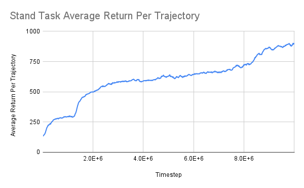
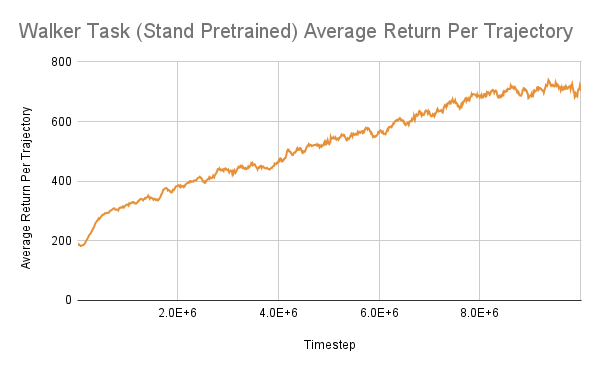
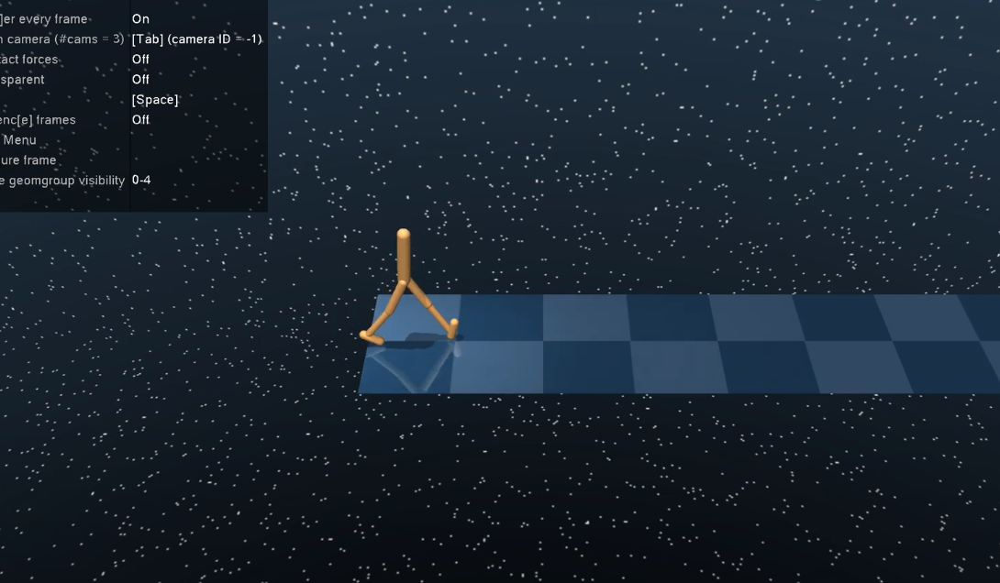
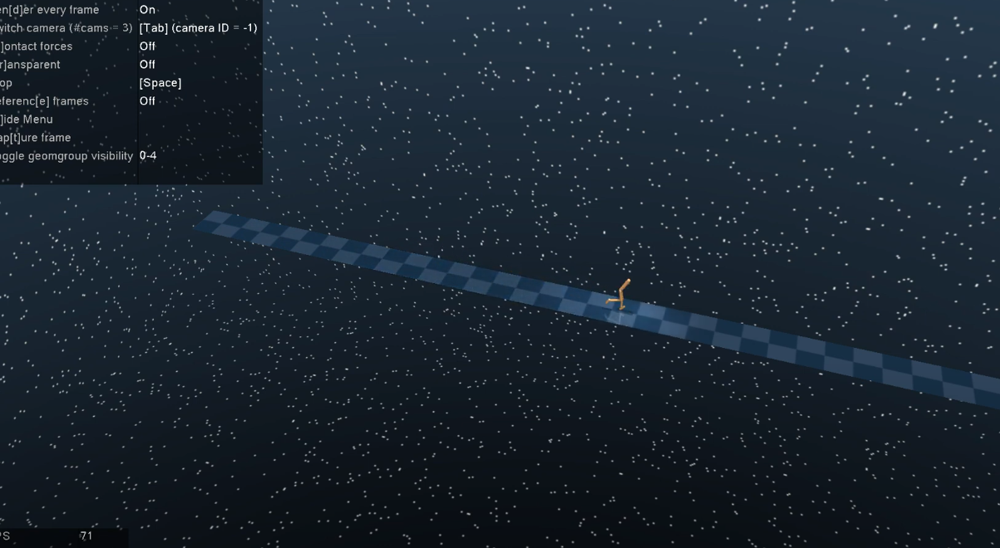

Train PPO on the [DeepMind Control walker](https://github.com/google-deepmind/dm_control) and you'll watch the agent flail for a long time before it starts walking. Millions of timesteps of falling on its head, finding inventive new ways to fail at staying upright, and then — somewhere around the four-millionth step — a stable stride.

The interesting question is what changed. Not the network: same three MLPs. Not the reward: same forward-velocity-times-uprightness throughout. Not even, at the macro scale, the algorithm. The same family of gradient updates that produced flailing for three million steps produced walking by the fourth.

Most introductions to [PPO](https://arxiv.org/abs/1707.06347) open with the clipped surrogate objective and an importance-sampling ratio. They're not wrong, but they bury the lede. PPO is less an algorithm than a *contract* with the gradient optimizer. It says: you may improve the policy. You may not lie to me about how much you've improved it.

Every design decision in PPO is a clause in that contract — a closed loophole the optimizer might otherwise use to claim improvement that isn't there. Some clauses are famous (the clip). Some are folklore (the buffer-boundary bootstrap). All of them are load-bearing in non-obvious ways.

What follows are the five I had to rediscover writing PPO from scratch. If you've implemented it before, you can skim Sections 2 and 3.

## 1. The optimizer will absolutely cheat if you let it

Every continuous-action policy needs a *width* — a number, σ, that controls how spread out the action distribution is. Big σ explores; small σ commits. Where σ comes from is, on the face of it, a minor architectural choice.

There are two natural answers. You can let the actor output it, learning $\log\sigma(s)$ as a second head alongside the mean. Or you can keep σ as a single learnable scalar per action dimension, completely independent of state.

I picked the first, because it was clearly more expressive. State-conditioned σ lets the policy be tentative in unfamiliar regions and confident on familiar terrain. Why would you settle for less?

I trained for an hour. Looked at the entropy curve. It had crashed to near-zero. The policy had decided that every state called for the same action with high confidence — which, of course, it shouldn't have, because the agent was still atrocious at the task.

Here is what happened. The mean action $\mu(s)$ was poor. Normally that's recoverable: we sample around $\mu$, sometimes get a good action, and the policy gradient nudges $\mu$ in the right direction. With state-conditioned σ, the optimizer has a second move available — it can shrink $\sigma(s)$ around the bad $\mu(s)$. From the surrogate's perspective, this is a perfectly sensible update; it raises the log-likelihood of the actions we actually took. The optimizer has not, technically, made the policy better. It has made the *gradient signal that would correct the policy* dimmer.

The optimizer found a way to satisfy its loss function without satisfying mine. This will be a recurring theme.

A free $\log\sigma$ admits no such trick. To shrink σ, the parameter has to drop globally — across all states, no exceptions. The optimizer can still do it, but only when it is genuinely, broadly the right move. The pathology is denied a hiding place.

```python
class Actor(nn.Module):
    def __init__(self, obs_dim, act_dim, net_arch, activation_fn=nn.Tanh):
        super().__init__()
        self.mlp = MLP([obs_dim] + net_arch + [act_dim], activation_fn)
        self.log_std = nn.Parameter(torch.zeros(act_dim, dtype=torch.float32))
```

This is the first clause of the contract: do not give the optimizer parameters it can use to dim its own reward signal. The lesson generalizes — entropy regularization, target networks, gradient clipping, learning-rate warmups all live in this same neighborhood — but I had to discover it for myself in the simplest possible setting before I really believed it.

## 2. The boundary cases are the algorithm

The actor and critic train on rollouts. Rollouts arrive from the environment in awkward shapes: episodes of varying lengths, sometimes ended by termination, sometimes by a time limit, sometimes still in progress when our schedule says it's time to stop collecting. PPO's solution is a fixed-size buffer that we fill up and then train on. Mine held 1024 timesteps. So far, so straightforward.

The interesting part is what to do at the seams.

Every episode boundary inside the buffer closes out a window over which we'll compute advantages, and every window needs a *bootstrap value* — the critic's best guess at the value of the state we got cut off in. Three boundary types, three different answers:

- **Termination.** The agent fell, solved the task, or otherwise reached a state with no future. Bootstrap from $0$.
- **Truncation.** The time limit ran out, but the agent could have kept going. Bootstrap from $V(s_{\text{last}})$.
- **Buffer full mid-episode.** We ran out of room before the episode ran out of steps. Bootstrap from $V(s_{\text{last}})$, identical to truncation.

<iframe src="rollout-buffer.html" height="320"></iframe>

**The third case looks like the second, and that's exactly the trap. dm_control fires its truncation signal when the time limit hits, not when our buffer fills.** I handled the first two cases on autopilot and quietly let the third one fall through. The training loop kept running.

What I noticed, after a few hours: the episode reward crept up, plateaued, and stayed at a value that wasn't terrible but wasn't good. Watching the rollouts, the agent looked competent for the last forty or fifty timesteps before each episode end and confused on everything earlier. Like a student who has only studied the answers to the last few questions on the exam.

The diagnosis took an embarrassingly long time. When the buffer filled mid-episode, the unterminated tail's advantages were never written, so those slots in the buffer kept whatever was previously at those indices — usually leftover advantages from an earlier rollout. The gradient updates on the tail steps were noise. The agent learned only from the parts of trajectories that ended cleanly within the buffer, which is exactly what I'd been seeing.

The fix was three lines. The lesson was bigger. In any algorithm where the data shape doesn't fit the buffer shape, *the boundary handling is not boilerplate*. Boilerplate-grade thinking produces buffer bugs that don't crash, don't throw warnings, don't even degrade the loss curves in obvious ways. They lobotomize the policy, quietly, while everything appears to be working.

## 3. The credit-assignment dial

A reward arrives at time $t+10$. How much of it should be attributed to the action you took at time $t$?

There is no objectively correct answer. There is a tradeoff — between *bias* and *variance*, the two great enemies of any estimator — and on either extreme of that tradeoff lives a different name.

If you assign credit only one timestep deep, treating the next state's value $V(s_{t+1})$ as a complete summary of everything that happens after, you get TD(0):

$$
\delta_t = r_t + \gamma V(s_{t+1}) - V(s_t).
$$

A single random sample. Low variance. Biased by whatever errors $V$ has. Cheap and confident — and possibly confidently wrong.

At the other extreme, ignore $V$ entirely and use the actual discounted sum of rewards from $t$ onward as your estimate. This is Monte Carlo. Unbiased, because you're using the actual trajectory rather than a guess. But every step of randomness in that trajectory is now baked into the estimate, and on a long episode the variance can be enormous.

[Generalized Advantage Estimation](https://arxiv.org/abs/1506.02438) is the dial between them:

$$
\hat A_t^{(\lambda)} = \sum_{k=0}^{\infty} (\gamma\lambda)^k \delta_{t+k}.
$$

When $\lambda = 0$, only the first term survives and we recover TD(0). When $\lambda = 1$, the geometric weights line up so that the sum collapses to the Monte-Carlo advantage. Everything in between is a continuous interpolation between the two failure modes — high bias on one end, high variance on the other.

<iframe src="gae.html" height="430"></iframe>

I picked $\lambda = 0.95$ because the GAE paper recommends it, and I didn't sweep the value. In my experiments, $\lambda$ moved the loss curves much less than any of the four other decisions in this post moved them — so I spent my hyperparameter budget elsewhere. (Whether this would still hold for tasks with longer horizons or sparser rewards, I genuinely don't know.)

The implementation has its own quiet pleasure. The infinite sum looks expensive, but the recurrence

$$
\hat A_t^{(\lambda)} = \delta_t + \gamma\lambda \hat A_{t+1}^{(\lambda)}
$$

is a backward IIR filter on the deltas, and SciPy ships an IIR filter. The whole computation collapses to one line:

```python
deltas = rewards + gamma * values[1:] - values[:-1]
advantages = lfilter([1], [1, -gamma * gae_lambda], deltas[::-1])[::-1]
returns    = advantages + values[:-1]
```

That last line is a small algebraic gift. The Monte-Carlo return obeys $R_t = \hat A_t + V(s_t)$ by definition — that's just the advantage rearranged. Once we have advantages and values, returns are free. No second pass over the rewards. The recurrence rewards you for trusting it.

## 4. The clip, the min, and a blind spot

We have arrived at the heart of the algorithm.

PPO's central equation is

$$
L^{\text{CLIP}}(\theta) = \mathbb{E}_t\!\left[\min\bigl(r_t(\theta)\hat A_t,\ \mathrm{clip}(r_t(\theta), 1-\epsilon, 1+\epsilon)\hat A_t\bigr)\right],
$$

where $r_t(\theta) = \pi_\theta(a_t \mid s_t) / \pi_{\theta_{\text{old}}}(a_t \mid s_t)$ is the importance-sampling ratio between the current policy and the one that generated the rollout. The first time you see this expression, the `min` looks redundant. *The clip is the trust region. What's the second term for?*

I asked the same question. So I deleted it.

```python
ratio = torch.exp(log_probs - rollout_data["log_probs"])
clipped = advantages * torch.clamp(ratio, 1 - self.clip_range, 1 + self.clip_range)
policy_loss = -clipped.mean()    # this is wrong, and here is why
```

Training was unstable. Not catastrophic — the agent learned, plateaued, regressed, learned, regressed. Sawtooth curves. I assumed I had a bug somewhere upstream and went looking, fruitlessly, for several hours.

The bug was the missing `min`. I only saw it once I drew the picture.

<iframe src="clipping.html" height="490"></iframe>

Drag the advantage slider — $A$ in the controls — through zero. When $A > 0$, the clip behaves the way intuition expects: as the policy grows more likely to take a good action ($r > 1+\epsilon$), the surrogate's gain saturates. We don't get to congratulate ourselves indefinitely for an action that's now much more likely than it used to be. Standard.

Now flip $A$ negative.

The action turned out to be bad ($\hat A_t < 0$). Suppose, despite that, the policy has somehow grown more likely to take it ($r > 1+\epsilon$). This is the very situation the trust region is supposed to *protest* about. Without the `min`, what does the surrogate do?

The clipped term, $\mathrm{clip}(r, 1-\epsilon, 1+\epsilon) \cdot \hat A_t$, saturates at the threshold value $(1+\epsilon)\hat A_t$ — a small negative number. The gradient of *that* with respect to θ, as $r$ grows past $1+\epsilon$, is zero. The optimizer is free to keep pushing $r$ in the direction it should be punished for, and the surrogate cannot see it.

Read that again, because it is the entire point. **The clip caps gains. It also caps costs. And the gradient stops flowing the moment the clip activates.** From the optimizer's perspective, once $r$ has exceeded $1+\epsilon$ on a bad action, there is no further loss to pay. Pushing $r$ higher is a free move.

The `min` closes the loophole. It selects whichever of the two terms — clipped or unclipped — is *worse* for the policy update. When $A > 0$ and $r > 1+\epsilon$, the clipped term is smaller and gets picked: gain saturates as before. When $A < 0$ and $r > 1+\epsilon$, the unclipped term $r\hat A_t$ is smaller (more negative) and gets picked: the full penalty applies, the gradient flows, the optimizer pays for its mistake.

```python
ratio = torch.exp(log_probs - rollout_data["log_probs"])
unclipped = advantages * ratio
clipped   = advantages * torch.clamp(ratio, 1 - self.clip_range, 1 + self.clip_range)
policy_loss = -torch.min(unclipped, clipped).mean()
```

Three lines. They look like they could have been written by an undergraduate. They were the difference between sawtooth curves and a stable training run.

There is a deeper lesson here about what a "trust region" actually is. The clip is usually motivated as a cap on the size of policy updates, and that framing is correct as far as it goes. But the *full* design — the clip plus the `min` — is a cap on something subtler. It is a guarantee that the optimizer can never improve its loss by stepping further away from $\pi_{\theta_{\text{old}}}$. Capping a magnitude is easy. Making sure the optimizer never has an incentive to game the magnitude — that is the contract.

## 5. Two trust regions don't compose

PPO is a relaxation of [TRPO](https://arxiv.org/abs/1502.05477), an earlier algorithm that enforces an explicit constraint on the KL divergence between consecutive policies. TRPO works — it has a respectable convergence story — but the per-step KL projection is expensive. PPO's clip is a cheap, approximate substitute for that constraint.

A natural thought, then: why not use both? Run the cheap clip during training, and add a KL early-stop as a backup catch when the clip somehow lets a too-large update through. Belt and suspenders.

I implemented it. The early-stop fires when the empirical KL exceeds $1.5 \times \text{target\_kl}$, the threshold from the original PPO paper. With $\text{target\_kl} = 0.015$, it fired more often than I expected, and the runs with it on were measurably worse than the runs without.

Here's why. With $\epsilon = 0.2$, the clip already produces a per-step KL well below typical KL targets — the clip is the *tighter* trust region of the two. The KL early-stop's effect was therefore not "catch the cases the clip missed" but "discard productive optimization epochs." Pure cost. The two trust regions did not compose. The cheaper one was strictly more conservative, so the more expensive one only ever got in the way.

I left the code in place — it might earn its keep with looser clip ranges, $\epsilon \geq 0.4$, where the trust regions are no longer redundant — but for now `target_kl = None`.

There is a worthwhile sub-decision lurking here. The natural KL estimator,

$$
\widehat{\mathrm{KL}}_{\text{naive}} = \mathbb{E}_t[\log r_t],
$$

is unbiased but can come out *negative* on finite samples. (KL is non-negative in expectation, not pointwise.) That's awkward when the value is being compared to a positive threshold. I switched to [Schulman's estimator](http://joschu.net/blog/kl-approx.html),

$$
\widehat{\mathrm{KL}} = \mathbb{E}_t\!\left[e^{\log r_t} - 1 - \log r_t\right],
$$

which has the same expectation, is provably non-negative, and has lower variance to boot. Two estimators of the same quantity can have very different finite-sample behavior. Pick the one whose tails play nicely with whatever you're feeding it into.

## A curriculum, because the floor is too inviting

The walker's reward function is roughly *forward velocity × uprightness*, which sounds well-shaped. It is not. There is a deep local optimum: lie on the ground. Velocity is zero, but the gradient signal pushing the agent to *get up* in the first place is weak — being on the floor isn't actively penalized, and the policy has no strong reason to discover that uprightness exists. From a cold start, it spends one to two million timesteps rediscovering this option.

So I cheated. The DeepMind Control suite ships a sister task called `stand` whose reward is uprightness alone — no forward velocity. I trained on `stand` for five million timesteps, transferred the policy parameters to `walker`, and trained for another ten million.

The intuition is decomposition. A from-scratch walker has to discover *both* uprightness and forward motion simultaneously, while the gradient signal for each is partly drowning out the other. A pretrained walker arrives with uprightness already solved; its training problem reduces to *adding forward motion to an existing posture*. Easier objective, faster convergence, higher final reward.

**Stand task — average return vs. timesteps. Note the steep early climb: once the policy stops trying to lie down (within ~100k steps), the reward signal is dense and smooth.**



**Walker task — average return vs. timesteps, initialized from the stand policy. The early steepness is the curriculum's contribution; without pretraining, this curve spent ~2M steps near zero before any progress.**



Hyperparameters across both stages: rollout 1024, learning rate $3 \times 10^{-5}$, batch size 32, 5 epochs per rollout, $\epsilon = 0.2$, $\gamma = 0.99$, $\lambda = 0.95$. Mostly defaults from [Stable Baselines 3](https://stable-baselines3.readthedocs.io/), which I used as a reference.

Two videos of the resulting policies:

- Standing: [youtu.be/LAQWy49GFf4](https://youtu.be/LAQWy49GFf4)
- Walking: [youtu.be/ALyPvbGXBOM](https://youtu.be/ALyPvbGXBOM)





## What's still unresolved

Three questions I left on the table.

**Is $\epsilon = 0.2$ actually the right default?** I left the clip range untouched on the strength of the paper's recommendation. Given how decisively a small change in the surrogate (Section 4) reshaped everything downstream, I'd guess the right $\epsilon$ is more task-specific than the literature lets on — and that loose-$\epsilon$ runs are where KL early-stopping (Section 5) might earn its keep.

**What if state-conditioned σ were paired with explicit entropy regularization?** Section 1 rejected state-conditioned σ because the optimizer collapses entropy to mask a bad mean. An entropy bonus in the loss would, in principle, prevent that. Every modern PPO implementation still uses free $\log\sigma$, which suggests the bonus isn't enough — but that's inferred consensus, not an experiment.

**What specifically transfers from `stand` to `walker`?** The decomposition story is plausible and also speculative. A clean ablation — what gets carried over, what gets relearned — would be enlightening, and I haven't found one in the literature.

I came in thinking PPO was a clip on an importance ratio. I left thinking it was a contract — five clauses long, a few of them folklore, all load-bearing in non-obvious ways. The algorithm is more interesting than its equations.
